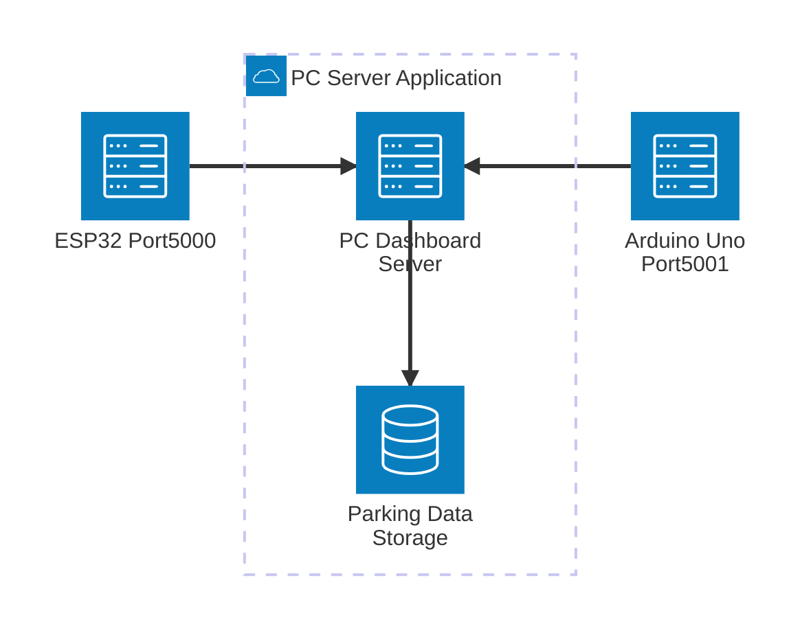
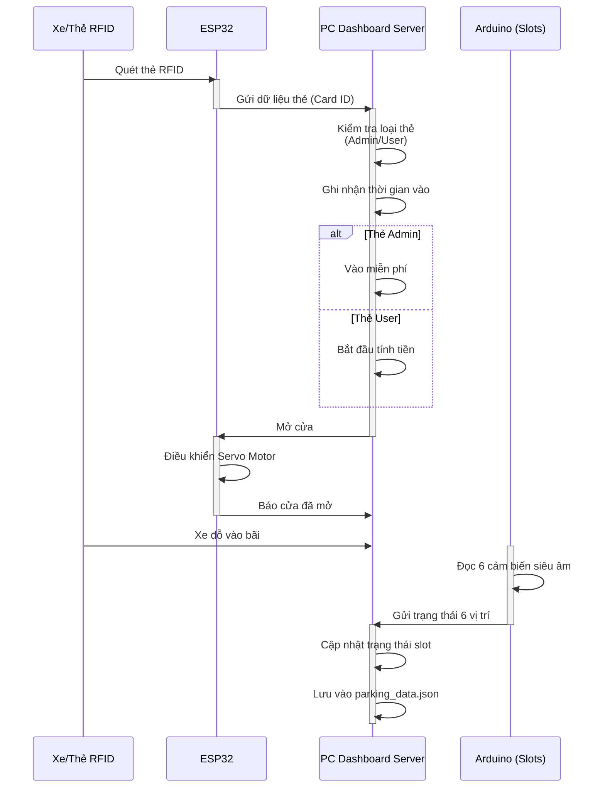
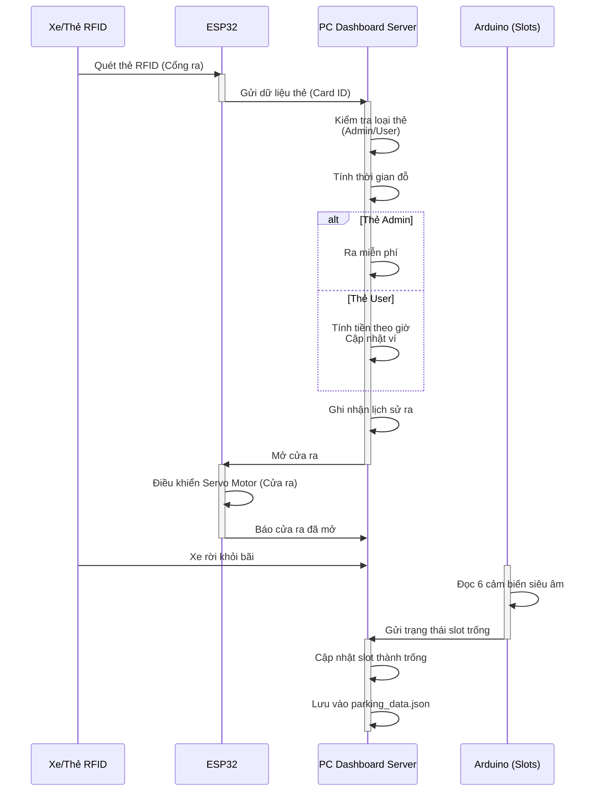
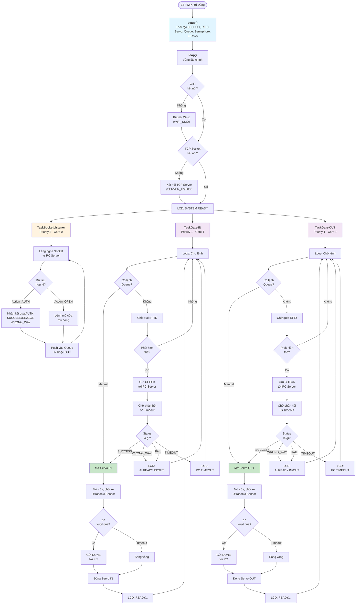
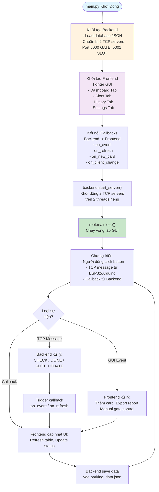
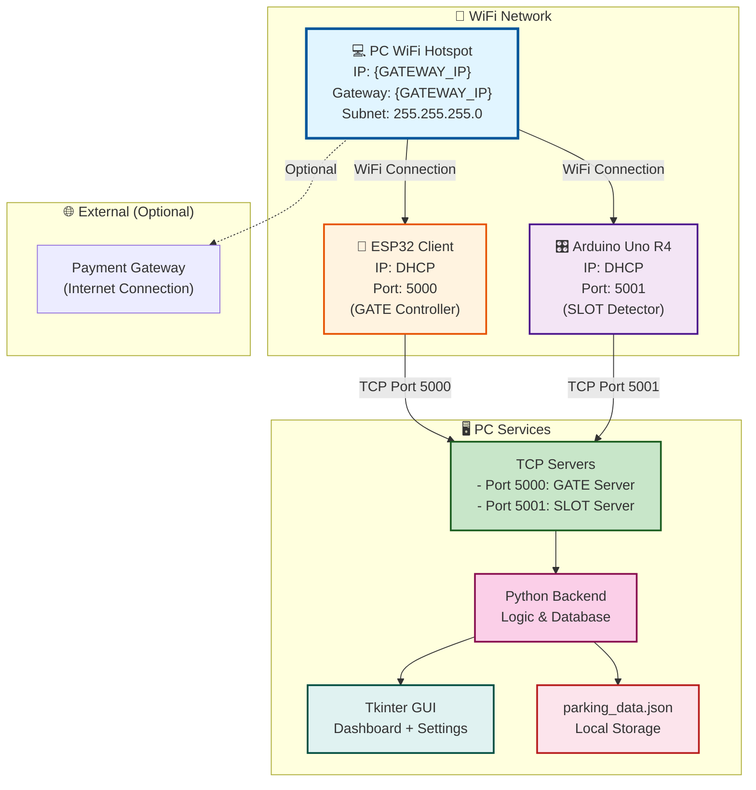

## 📊 **Các Loại Biểu Đồ Nên Dùng:**

### **1. Kiến Trúc Hệ Thống**
- **Architecture Diagram**: Hiển thị mối quan hệ giữa ESP32, Arduino, PC App, và kết nối mạng

#### Architecture Diagram - Sơ đồ Client-Server

**Mô tả Client-Server:**
- **PC Application** (Server): Lắng nghe trên port 5000 & 5001, quản lý dữ liệu, hiển thị dashboard
  - **ESP32 (Client Port 5000)**: Kết nối tới Server, gửi dữ liệu RFID và điều khiển Cửa tự động
  - **Arduino Uno R4 (Client Port 5001)**: Kết nối tới Server, gửi trạng thái 6 vị trí đỗ xe
  - **Storage**: Lưu trữ dữ liệu vào file JSON (parking_data.json)

**Luồng giao tiếp:**
- ESP32 → PC Server (Port 5000): RFID tags, obstacle sensors
- Arduino R4 → PC Server (Port 5001): Parking slot occupancy (6 sensors)
- PC Server → Both Clients: Control commands (door control, etc.)

#### Sequence Diagram - Luồng Giao Tiếp Chi Tiết

**Mô tả Sequence Diagram (Xe vào Bãi):**
1. **Quét RFID**: Xe đưa thẻ vào máy quét RFID trên ESP32
2. **Kiểm tra loại thẻ**: PC Server kiểm tra xem thẻ là Admin (miễn phí) hay User (tính tiền)
3. **Điều khiển cửa**: ESP32 nhận lệnh mở cửa, điều khiển Servo Motor
4. **Phát hiện chỗ trống**: Arduino đọc 6 cảm biến siêu âm, báo trạng thái 6 vị trí đỗ
5. **Lưu dữ liệu**: PC Server cập nhật trạng thái slot và lưu vào parking_data.json

#### Sequence Diagram (Xe ra Bãi)

**Mô tả Sequence Diagram (Xe ra Bãi):**
1. **Quét RFID ra**: Xe quét thẻ tại cổng ra
2. **Tính toán phí**: PC Server tính thời gian đỗ và tiền phí (nếu là User)
   - Admin ra miễn phí
   - User: Tính tiền/giờ, cập nhật ví
3. **Ghi nhận lịch sử**: PC Server lưu ghi nhận xe ra
4. **Mở cửa ra**: ESP32 mở Servo Motor cửa ra
5. **Phát hiện slot trống**: Arduino phát hiện xe rời khỏi, báo slot trống
6. **Cập nhật dữ liệu**: PC Server cập nhật trạng thái slot và lưu JSON

### **2. Luồng Hoạt Động**
- **Sơ đồ quy trình (Flowchart)**: Quy trình xe vào/ra, tính tiền
- **Sơ đồ trạng thái (State Diagram)**: Trạng thái các slot (trống/đã đỗ)

#### Flowchart - baidoxe.ino (ESP32 Gate Controller)

**Mô tả:**
- **setup()**: Khởi tạo hardware (LCD I2C, SPI bus cho 2 RFID readers, 2 Servo motors, 4 Ultrasonic sensors)
- **loop()**: Duy trì kết nối WiFi và TCP socket
- **3 Tasks (FreeRTOS)**:
  - `TaskSocketListener` (Priority 3): Lắng nghe dữ liệu từ PC Server, parse JSON, push kết quả vào Queue
  - `TaskGate-IN` (Priority 1): Xử lý cửa vào - scan RFID, kiểm tra, mở cửa
  - `TaskGate-OUT` (Priority 1): Xử lý cửa ra - scan RFID, kiểm tra, mở cửa

**Quy trình chính (TaskGate)**:
1. Chờ lệnh từ Queue (manual open hoặc từ Socket)
2. Quét RFID (nếu không có lệnh manual)
3. Gửi CHECK request tới PC Server
4. Chờ phản hồi xác thực (5s timeout)
5. Nếu SUCCESS → Mở Servo, chờ xe vượt qua
6. Gửi DONE notification tới PC, đóng Servo
7. Quay lại bước 1

#### Flowchart - main.py (Entry Point)

**Mô tả:**
- **Khởi tạo Backend**: Load dữ liệu, tạo 2 TCP servers (Port 5000 cho ESP32, 5001 cho Arduino)
- **Khởi tạo Frontend**: Tạo Tkinter GUI với 4 tabs (Dashboard, Slots, History, Settings)
- **Kết nối Callbacks**: Frontend lắng nghe sự kiện từ Backend
- **Vòng lặp chính**: Chờ sự kiện từ TCP, GUI, hoặc Backend callback → Xử lý → Cập nhật UI → Lưu dữ liệu

#### Flowchart - backend.py (Server TCP & Logic Xử Lý)

**Mô tả:**
- **2 Socket Servers**: Port 5000 (GATE) cho ESP32, Port 5001 (SLOT) cho Arduino
- **3 loại Messages**:
  - **CHECK**: Kiểm tra thẻ → Admin (SUCCESS/0đ) hoặc User (Check luồng VÀO/RA)
  - **DONE**: Cập nhật card status, tính phí (nếu RA), lưu history
  - **SLOT_UPDATE**: Cập nhật trạng thái 6 vị trí đỗ (VACANT/OCCUPIED)
- **Database**: Lưu tất cả vào parking_data.json

#### Flowchart - frontend.py (Tkinter GUI & User Interface)

**Mô tả:**
- **4 Tabs**: Dashboard (active cars), Slots (6 vị trí), History (logs), Settings (config)
- **UI Loop**: Refresh mỗi 200ms, realtime update thời gian & phí
- **Callbacks từ Backend**:
  - `on_event`: Thêm log động
  - `on_refresh`: Cập nhật tất cả
  - `on_new_card`: Pop-up thêm thẻ mới
  - `on_client_change`: Cập nhật Status LED
- **User Actions**: Pin/remove cards, export reports, manual gate control, set hourly rate

### **4. Cơ Sở Hạ Tầng - Network Diagram**

#### Network Topology - Sơ đồ Kết nối Mạng

**Mô tả Network:**

**WiFi Layer:**
- **SSID**: {NETWORK_SSID} (2.4GHz 802.11n)
- **Mode**: PC tạo WiFi Hotspot
- **Gateway**: {GATEWAY_IP} (PC)
- **Subnet Mask**: 255.255.255.0
- **DHCP**: Cấp IP tự động cho ESP32 & Arduino

**Thiết bị kết nối:**
- **PC WiFi Hotspot** (Trung tâm):
  - IP: {GATEWAY_IP}
  - Gateway & Server chính
  - Lắng nghe Port 5000 & 5001
  
- **ESP32 (GATE Controller)**:
  - IP: Nhận từ DHCP
  - Kết nối TCP tới PC:5000
  - Gửi: RFID data, sensor data
  - Nhận: Door control commands
  
- **Arduino Uno R4 (SLOT Detector)**:
  - IP: Nhận từ DHCP
  - Kết nối TCP tới PC:5001
  - Gửi: 6 slot occupancy status
  - Nhận: Control commands (nếu có)

**TCP Ports:**
- **Port 5000 (GATE Server)**: Xử lý ESP32 signals
  - CHECK: Thẻ kiểm tra
  - DONE: Cửa đã đóng
  - Status: Trạng thái
  
- **Port 5001 (SLOT Server)**: Xử lý Arduino signals
  - SLOT_UPDATE: Cập nhật 6 vị trí
  - Dữ liệu: VACANT / OCCUPIED

**PC Local Services:**
- **Backend (Python)**: Xử lý logic, lưu JSON
- **Frontend (Tkinter)**: Giao diện Dashboard
- **Database**: parking_data.json

**Optional:**
- Payment Gateway integration (Internet connection)

**Lợi ích hệ thống:**
✅ Locally hosted → No internet required  
✅ DHCP automatic IP → Plug & play  
✅ Dual TCP servers → Separate GATE & SLOT handling  
✅ JSON local storage → Fast access & backup

