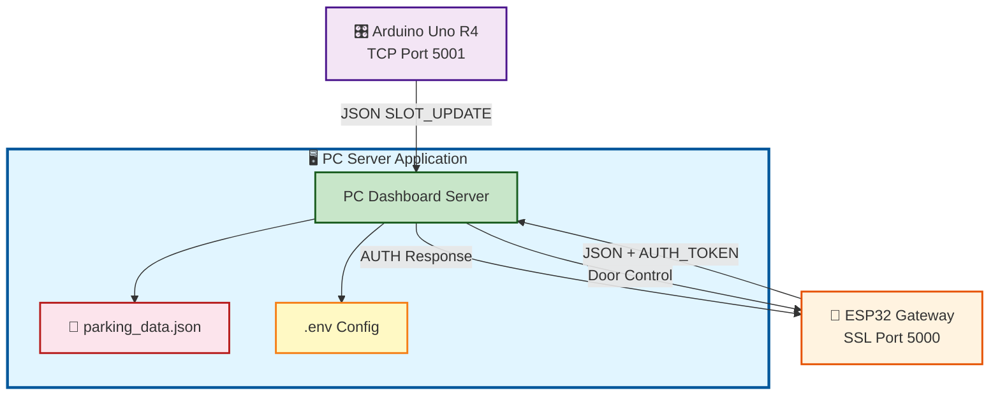
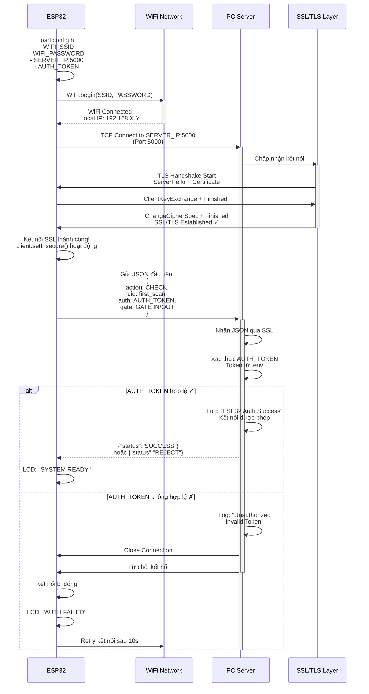
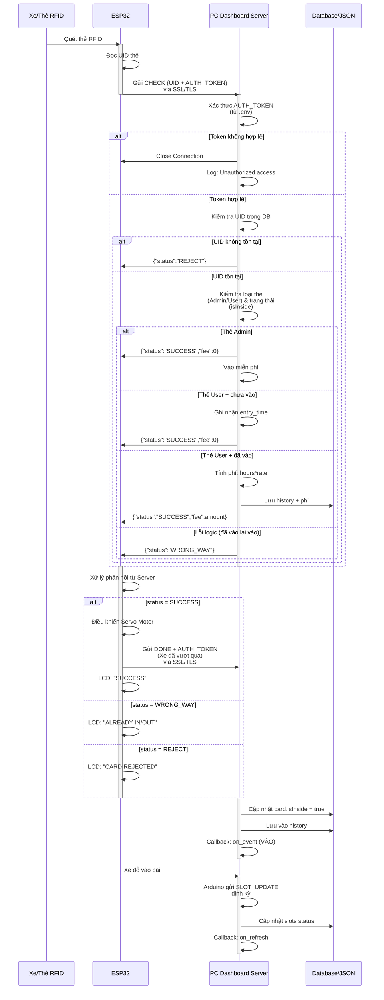
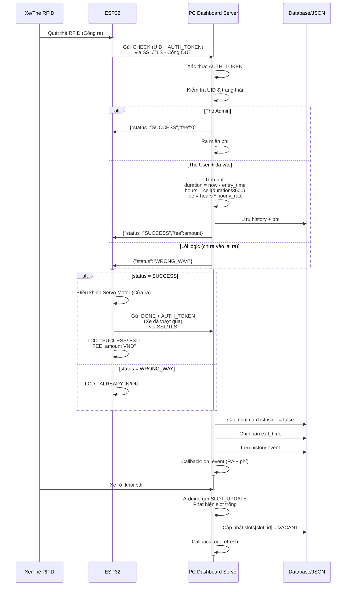
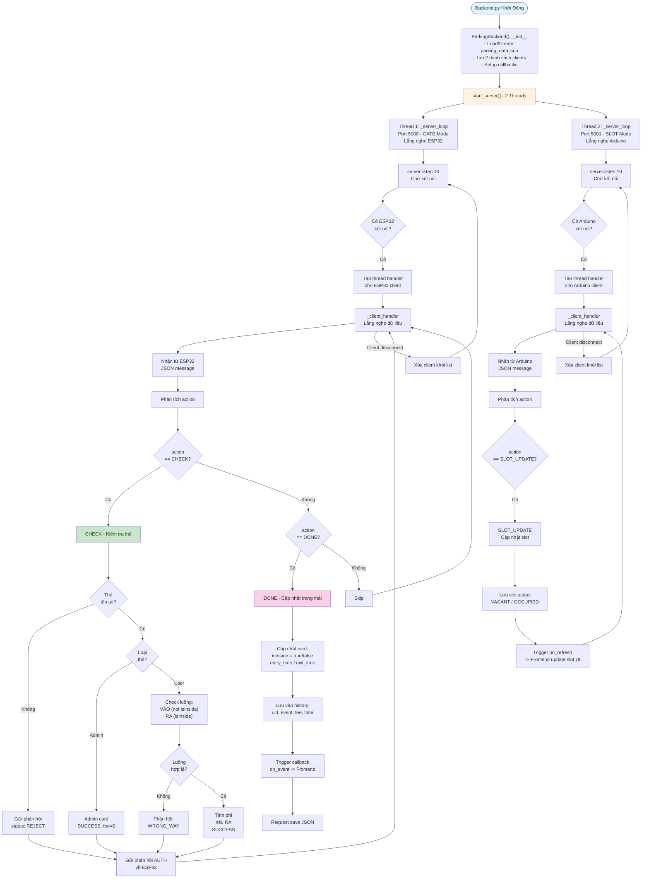
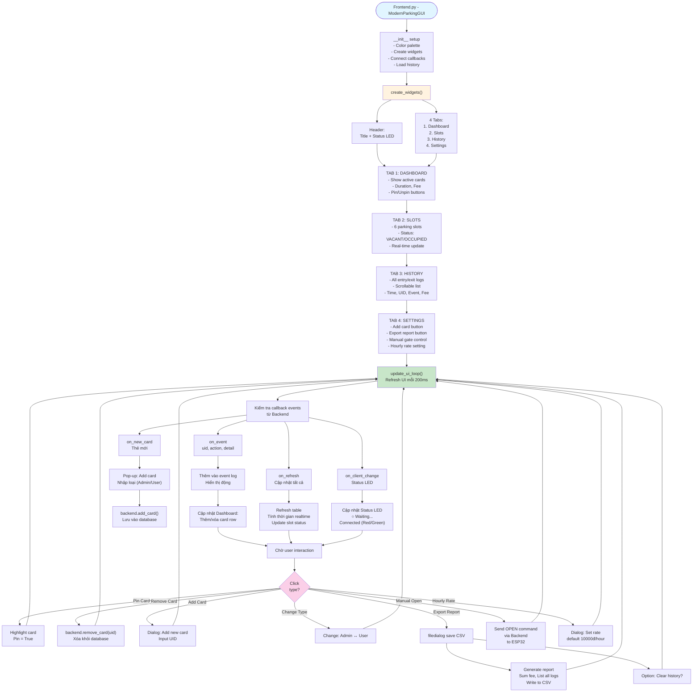
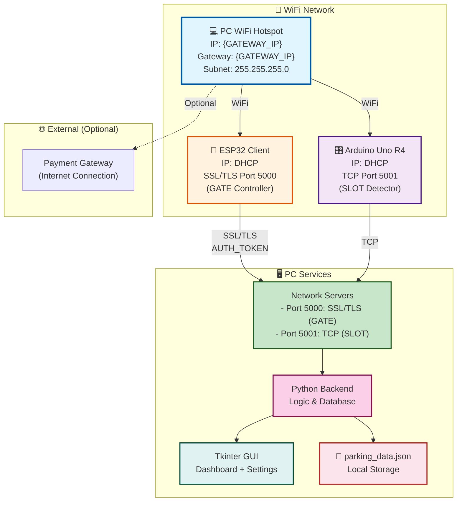

## 📊 **Các Loại Biểu Đồ Nên Dùng:**

### **1. Kiến Trúc Hệ Thống**
- **Architecture Diagram**: Hiển thị mối quan hệ giữa ESP32, Arduino, PC App, và kết nối mạng

#### Architecture Diagram - Sơ đồ Client-Server (SSL/TLS)

**Mô tả Client-Server:**
- **PC Application** (Server): Lắng nghe trên 2 ports riêng, quản lý dữ liệu, hiển thị dashboard
  - **ESP32 (SSL Client Port 5000)**: Kết nối SSL/TLS, xác thực bằng AUTH_TOKEN, gửi RFID data
  - **Arduino Uno R4 (TCP Client Port 5001)**: Kết nối TCP, gửi trạng thái 6 vị trí đỗ xe
  - **Config**: Load từ `.env` (SSID, Password, AUTH_TOKEN, Hourly Rate)
  - **Storage**: Lưu trữ dữ liệu vào file JSON (parking_data.json) + Logging

**Luồng giao tiếp:**
- **ESP32 ↔ PC** (Port 5000 SSL/TLS): JSON messages với AUTH_TOKEN xác thực
  - CHECK: Gửi UID thẻ, chờ xác thực (SUCCESS/REJECT/WRONG_WAY)
  - DONE: Thông báo xe đã vượt qua
- **Arduino ↔ PC** (Port 5001 TCP): JSON messages định kỳ
  - SLOT_UPDATE: Trạng thái 6 cảm biến siêu âm
- **PC ↔ ESP32**: Lệnh điều khiển (OPEN, AUTH response)

#### Sequence Diagram - ESP32 Xác Thực Kết Nối với PC (SSL/TLS Handshake)

**Mô tả Xác Thực Kết Nối:**
1. **Load Config**: ESP32 đọc `config.h` (SSID, Password, SERVER_IP, AUTH_TOKEN)
2. **WiFi Connect**: Kết nối WiFi với tên và mật khẩu
3. **TCP Connect**: Kết nối tới PC Server trên Port 5000
4. **SSL/TLS Handshake**: 
   - Server gửi chứng chỉ (self-signed từ `gen_cert.py`)
   - ESP32 chấp nhận chứng chỉ (setInsecure() vì tự ký)
   - Thiết lập kênh mã hóa
5. **Gửi CHECK Message**: ESP32 gửi message đầu tiên với **AUTH_TOKEN** trong JSON
6. **Server Verification**:
   - ✅ Token hợp lệ → Kết nối được phép, LCD "SYSTEM READY"
   - ❌ Token sai → Đóng kết nối, LCD "AUTH FAILED", retry sau 10s
7. **Persistent Connection**: Giữ kết nối mở để gửi/nhận messages sau

#### Sequence Diagram - Luồng Giao Tiếp Chi Tiết (Xe vào Bãi)

**Mô tả Sequence Diagram (Xe vào Bãi):**
1. **Quét RFID**: Xe đưa thẻ vào máy quét RFID trên ESP32
2. **Gửi CHECK**: ESP32 gửi UID + **AUTH_TOKEN** tới PC Server qua **SSL/TLS**
3. **Xác thực Token**: Server kiểm tra AUTH_TOKEN (từ `.env`), từ chối nếu không đúng
4. **Kiểm tra loại thẻ**: Server kiểm tra UID, loại thẻ (Admin/User), trạng thái (isInside)
5. **Tính toán**: Nếu là User vào lần đầu → ghi nhận thời gian, nếu ra → tính tiền
6. **Phản hồi**: Server gửi SUCCESS/REJECT/WRONG_WAY
7. **Điều khiển cửa**: ESP32 mở Servo, gửi DONE khi xe vượt qua
8. **Lưu dữ liệu**: Server cập nhật DB, phát callback để Frontend refresh

#### Sequence Diagram - Luồng Giao Tiếp Chi Tiết (Xe ra Bãi)

**Mô tả Sequence Diagram (Xe ra Bãi):**
1. **Quét RFID ra**: Xe quét thẻ tại cổng ra
2. **Gửi CHECK**: ESP32 gửi CHECK tới Server qua SSL/TLS (PORT_OUT)
3. **Tính toán phí**: Server tính thời gian đỗ (duration) và phí
   - Admin: Phí = 0đ
   - User: `hours = ceil((exit_time - entry_time)/3600)`, `fee = hours × hourly_rate` (từ .env)
4. **Lưu history**: Server lưu transaction vào history + database
5. **Mở cửa ra**: ESP32 mở Servo Motor cửa ra, hiển thị phí trên LCD
6. **Phát hiện slot trống**: Arduino phát hiện xe rời khỏi, báo slot trống
7. **Callback**: Server phát event để Frontend refresh UI

### **2. Luồng Hoạt Động**
- **Sơ đồ quy trình (Flowchart)**: Quy trình xe vào/ra, tính tiền
- **Sơ đồ trạng thái (State Diagram)**: Trạng thái các slot (trống/đã đỗ)

#### Flowchart - baidoxe.ino (ESP32 Gate Controller - SSL/TLS với AUTH_TOKEN)

```mermaid
flowchart TD
    Start([ESP32 Khởi Động]) --> LoadConfig["<b>Load config.h</b><br/>- WIFI_SSID, WIFI_PASSWORD<br/>- SERVER_IP, SERVER_PORT<br/>- AUTH_TOKEN"]
    
    LoadConfig --> Setup["<b>setup()</b><br/>Khởi tạo:<br/>- LCD I2C (SDA:21, SCL:22)<br/>- SPI chung: SCK(18), MOSI(23), MISO(19)<br/>- 2 RFID readers (SPI)<br/>- 2 Servo motors<br/>- 4 Ultrasonic sensors<br/>- 3 Tasks + Semaphores + Queues"]
    
    Setup --> Loop["<b>loop()</b><br/>Vòng lặp chính"]
    
    Loop --> MaintainConn{"WiFi<br/>kết nối?"}
    MaintainConn -->|Không| ConnectWiFi["Kết nối WiFi:<br/>ssid & password<br/>từ config.h"]
    ConnectWiFi --> CheckSocket{"SSL Socket<br/>kết nối?"}
    MaintainConn -->|Có| CheckSocket
    
    CheckSocket -->|Không| ConnectSocket["Kết nối SSL/TLS<br/>Server: config.h<br/>IP:PORT"]
    ConnectSocket --> SetInsecure["setInsecure()<br/>Chấp nhận chứng chỉ<br/>tự ký (test)"]
    SetInsecure --> Ready["LCD: SYSTEM READY<br/>WIFI + SOCKET"]
    CheckSocket -->|Có| Ready
    
    Ready --> TaskListener["<b>TaskSocketListener</b><br/>Priority 3 - Core 0"]
    Ready --> TaskGateIN["<b>TaskGate-IN</b><br/>Priority 1 - Core 1"]
    Ready --> TaskGateOUT["<b>TaskGate-OUT</b><br/>Priority 1 - Core 1"]
    
    TaskListener --> ListenLoop["Lắng nghe SSL Socket<br/>từ PC Server"]
    ListenLoop --> ParseJSON{"Dữ liệu<br/>hợp lệ JSON?"}
    ParseJSON -->|Lỗi parse| ListenLoop
    ParseJSON -->|Action=AUTH| ReceiveAuth["Nhận phản hồi:<br/>- status: SUCCESS/<br/>  REJECT/WRONG_WAY<br/>- fee (nếu có)"]
    ParseJSON -->|Action=OPEN| ManualOpen["Lệnh mở cửa<br/>thủ công từ App"]
    ReceiveAuth --> PushQueue["Push GateMsg vào<br/>Queue IN hoặc OUT"]
    ManualOpen --> PushQueue
    PushQueue --> ListenLoop
    
    TaskGateIN --> GateINLoop["Loop: Chờ lệnh"]
    TaskGateOUT --> GateOUTLoop["Loop: Chờ lệnh"]
    
    GateINLoop --> CheckQueueIN{"Có lệnh<br/>Queue?"}
    GateOUTLoop --> CheckQueueOUT{"Có lệnh<br/>Queue?"}
    
    CheckQueueIN -->|Manual| OpenIN["Mở Servo IN<br/>SERVO_OPEN_ANGLE"]
    CheckQueueIN -->|Không| ScanRFDIN["Chờ quét RFID<br/>RFID IN"]
    
    CheckQueueOUT -->|Manual| OpenOUT["Mở Servo OUT<br/>SERVO_OPEN_ANGLE"]
    CheckQueueOUT -->|Không| ScanRFDOUT["Chờ quét RFID<br/>RFID OUT"]
    
    ScanRFDIN --> CardIN{"Phát hiện<br/>thẻ?"}
    ScanRFDOUT --> CardOUT{"Phát hiện<br/>thẻ?"}
    
    CardIN -->|Không| GateINLoop
    CardOUT -->|Không| GateOUTLoop
    
    CardIN -->|Có| ExtractUID_IN["Đọc UID thẻ<br/>Convert sang HEX"]
    CardOUT -->|Có| ExtractUID_OUT["Đọc UID thẻ<br/>Convert sang HEX"]
    
    ExtractUID_IN --> SendCheckIN["Gửi JSON qua SSL:<br/>{<br/>  action: CHECK,<br/>  gate: GATE IN,<br/>  uid: UID,<br/>  auth: AUTH_TOKEN<br/>}<br/>sendJson()"]
    ExtractUID_OUT --> SendCheckOUT["Gửi JSON qua SSL:<br/>{<br/>  action: CHECK,<br/>  gate: GATE OUT,<br/>  uid: UID,<br/>  auth: AUTH_TOKEN<br/>}"]
    
    SendCheckIN --> WaitAuthIN["Chờ phản hồi từ Queue<br/>Timeout: 5s<br/>xQueueReceive()"]
    SendCheckOUT --> WaitAuthOUT["Chờ phản hồi từ Queue<br/>Timeout: 5s"]
    
    WaitAuthIN --> CheckAuthIN{"Phản hồi<br/>là gì?"}
    WaitAuthOUT --> CheckAuthOUT{"Phản hồi<br/>là gì?"}
    
    CheckAuthIN -->|SUCCESS| OpenIN
    CheckAuthIN -->|WRONG_WAY| RejectIN["LCD:<br/>ALREADY IN/OUT"]
    CheckAuthIN -->|REJECT| RejectIN2["LCD:<br/>CARD REJECTED"]
    CheckAuthIN -->|TIMEOUT| TimeoutIN["LCD:<br/>PC TIMEOUT"]
    
    CheckAuthOUT -->|SUCCESS| OpenOUT
    CheckAuthOUT -->|WRONG_WAY| RejectOUT["LCD:<br/>ALREADY IN/OUT"]
    CheckAuthOUT -->|REJECT| RejectOUT2["LCD:<br/>CARD REJECTED"]
    CheckAuthOUT -->|TIMEOUT| TimeoutOUT["LCD:<br/>PC TIMEOUT"]
    
    RejectIN --> GateINLoop
    RejectIN2 --> GateINLoop
    TimeoutIN --> GateINLoop
    RejectOUT --> GateOUTLoop
    RejectOUT2 --> GateOUTLoop
    TimeoutOUT --> GateOUTLoop
    
    OpenIN --> WaitVehicleIN["Mở cửa, chờ xe<br/>Ultrasonic Sensor IN<br/>getDistance()"]
    OpenOUT --> WaitVehicleOUT["Mở cửa, chờ xe<br/>Ultrasonic Sensor OUT"]
    
    WaitVehicleIN --> PassIN{"Xe vượt<br/>qua?<br/>Timeout 15s"}
    WaitVehicleOUT --> PassOUT{"Xe vượt<br/>qua?"}
    
    PassIN -->|Có| SendDoneIN["Gửi JSON qua SSL:<br/>{<br/>  action: DONE,<br/>  uid: UID,<br/>  auth: AUTH_TOKEN<br/>}"]
    PassIN -->|Timeout| TimeoutServoIN["LCD: TIMEOUT! CLOSED"]
    
    PassOUT -->|Có| SendDoneOUT["Gửi JSON qua SSL:<br/>{<br/>  action: DONE,<br/>  uid: UID,<br/>  auth: AUTH_TOKEN<br/>}"]
    PassOUT -->|Timeout| TimeoutServoOUT["LCD: TIMEOUT! CLOSED"]
    
    SendDoneIN --> CloseIN["Đóng Servo IN<br/>SERVO_CLOSED_ANGLE"]
    TimeoutServoIN --> CloseIN
    
    SendDoneOUT --> CloseOUT["Đóng Servo OUT<br/>SERVO_CLOSED_ANGLE"]
    TimeoutServoOUT --> CloseOUT
    
    CloseIN --> ReadyIN["LCD: PARKING SYSTEM<br/>READY..."]
    CloseOUT --> ReadyOUT["LCD: PARKING SYSTEM<br/>READY..."]
    
    ReadyIN --> GateINLoop
    ReadyOUT --> GateOUTLoop
    
    style Start fill:#e1f5ff
    style LoadConfig fill:#ffccbc
    style Setup fill:#e1f5ff
    style TaskListener fill:#fff3e0
    style TaskGateIN fill:#f3e5f5
    style TaskGateOUT fill:#f3e5f5
    style OpenIN fill:#c8e6c9
    style OpenOUT fill:#c8e6c9
    style SendCheckIN fill:#bbdefb
    style SendCheckOUT fill:#bbdefb
    style SendDoneIN fill:#bbdefb
    style SendDoneOUT fill:#bbdefb
```

**Mô tả Flowchart (Cập nhật):**
- **Load config.h**: SSID, Password, Server IP, AUTH_TOKEN
- **SSL/TLS Connection**: Kết nối với PC Server qua SSL, chứng chỉ tự ký
- **sendJson()**: Gửi JSON qua SSL với **auth: AUTH_TOKEN** trong mọi message
- **TaskSocketListener**: Lắng nghe phản hồi từ Server (AUTH response)
- **TaskGate-IN/OUT**: 
  1. Scan RFID → Đọc UID
  2. Gửi CHECK qua SSL (kèm AUTH_TOKEN)
  3. Chờ phản hồi 5s (SUCCESS/REJECT/WRONG_WAY)
  4. Nếu SUCCESS → Mở Servo, chờ xe vượt qua
  5. Gửi DONE qua SSL (kèm AUTH_TOKEN)
  6. Đóng Servo, quay về trạng thái Ready

#### Flowchart - main.py & backend.py (Entry Point & Server)

```mermaid
flowchart TD
    Start([main.py Khởi Động]) --> LoadEnv["<b>Load .env</b><br/>- SSID, PASSWORD<br/>- PORT_GATE (5000)<br/>- PORT_SLOT (5001)<br/>- HOURLY_RATE<br/>- AUTH_TOKEN"]
    
    LoadEnv --> CheckSSL{"SSL Certificates<br/>(server.crt,<br/>server.key)<br/>tồn tại?"}
    
    CheckSSL -->|Không| GenSSL["Chạy gen_cert.py<br/>Tạo chứng chỉ tự ký<br/>10 năm có hiệu lực"]
    GenSSL --> Backend["Khởi tạo Backend<br/>- Load database JSON<br/>- Chuẩn bị 2 TCP servers<br/>Port 5000: GATE (SSL)<br/>Port 5001: SLOT (TCP)"]
    CheckSSL -->|Có| Backend
    
    Backend --> InitFront["Khởi tạo Frontend<br/>Tkinter GUI<br/>- Dashboard Tab<br/>- Slots Tab<br/>- History Tab<br/>- Settings Tab"]
    
    InitFront --> ConnectCallback["Kết nối Callbacks<br/>Backend → Frontend<br/>- on_event<br/>- on_refresh<br/>- on_new_card<br/>- on_client_change"]
    
    ConnectCallback --> StartServers["backend.start_server()<br/>2 threads riêng biệt"]
    
    StartServers --> Server1["<b>Port 5000 (GATE)</b><br/>SSL/TLS Server<br/>- Load SSL context<br/>- Lắng nghe kết nối<br/>- Wrap socket với SSL"]
    
    StartServers --> Server2["<b>Port 5001 (SLOT)</b><br/>TCP Server<br/>- Không dùng SSL<br/>- Lắng nghe kết nối"]
    
    Server1 --> ListenGate["Chờ ESP32 kết nối"]
    Server2 --> ListenSlot["Chờ Arduino kết nối"]
    
    ListenGate --> AcceptGate["Chấp nhận kết nối<br/>Wrap with SSL"]
    ListenSlot --> AcceptSlot["Chấp nhận kết nối"]
    
    AcceptGate --> HandleGate["_client_handler(GATE)<br/>- Đọc dữ liệu JSON<br/>- Xác thực AUTH_TOKEN<br/>- Gọi handle_msg()"]
    
    AcceptSlot --> HandleSlot["_client_handler(SLOT)<br/>- Đọc dữ liệu JSON<br/>- Gọi handle_msg()"]
    
    HandleGate --> ProcessCheck{"Action?"}
    HandleSlot --> ProcessSlot{"Action?"}
    
    ProcessCheck -->|CHECK| AuthCheck["<b>handle_msg (CHECK)</b><br/>1. Xác thực AUTH_TOKEN<br/>   → Từ chối nếu sai<br/>2. Kiểm tra UID tồn tại<br/>3. Kiểm tra loại thẻ<br/>4. Kiểm tra trạng thái"]
    
    AuthCheck --> CalcFee["Tính toán:<br/>- Admin: fee = 0<br/>- User vào: ghi nhận<br/>  entry_time<br/>- User ra: tính phí<br/>  hours = ceil(duration/3600)<br/>  fee = hours × HOURLY_RATE"]
    
    CalcFee --> ResponseCheck["Gửi phản hồi:<br/>{<br/>  status: SUCCESS/<br/>    REJECT/WRONG_WAY,<br/>  fee: amount<br/>}"]
    
    ProcessCheck -->|DONE| RecordDone["<b>handle_msg (DONE)</b><br/>- Cập nhật card.isInside<br/>- Ghi nhận entry/exit_time<br/>- Lưu vào history<br/>- Trigger callback"]
    
    ProcessSlot -->|SLOT_UPDATE| UpdateSlot["<b>handle_msg (SLOT_UPDATE)</b><br/>- Cập nhật slots[id] = status<br/>- Lưu DB<br/>- Trigger on_refresh"]
    
    ResponseCheck --> TriggerCallback["Trigger Callback:<br/>- on_event<br/>- on_refresh"]
    RecordDone --> TriggerCallback
    UpdateSlot --> TriggerCallback
    
    TriggerCallback --> FrontendUpdate["Frontend nhận<br/>callback → Refresh UI"]
    
    TriggerCallback --> SaveDB["ParkingStore.request_save()<br/>→ Debounce 1s<br/>→ Lưu vào JSON"]
    
    SaveDB --> LogEvent["Log event<br/>vào logs/parking_DATE.log"]
    
    FrontendUpdate --> GuiLoop["Tkinter GUI Event Loop"]
    LogEvent --> GuiLoop
    
    GuiLoop --> UserAction{"User Action?"}
    
    UserAction -->|Add Card| AddCard["Thêm thẻ mới<br/>- Ghi vào database<br/>- Trigger on_new_card"]
    UserAction -->|Export Report| ExportReport["Xuất báo cáo<br/>- Tổng tiền<br/>- Chi tiết transaction<br/>- Export CSV/Excel"]
    UserAction -->|Manual Gate| ManualGate["Lệnh mở cửa<br/>- Gửi OPEN command<br/>- Tới cửa được chọn"]
    UserAction -->|Settings| Settings["Cập nhật settings<br/>- HOURLY_RATE<br/>- Cập nhật .env"]
    
    AddCard --> GuiLoop
    ExportReport --> GuiLoop
    ManualGate --> GuiLoop
    Settings --> GuiLoop
    
    style LoadEnv fill:#ffccbc
    style CheckSSL fill:#ffe0b2
    style GenSSL fill:#ffccbc
    style Backend fill:#e1f5ff
    style InitFront fill:#f3e5f5
    style StartServers fill:#fff3e0
    style Server1 fill:#c8e6c9
    style Server2 fill:#c8e6c9
    style AuthCheck fill:#bbdefb
    style CalcFee fill:#bbdefb
    style ResponseCheck fill:#bbdefb
    style SaveDB fill:#ffccbc
    style GuiLoop fill:#ce93d8
```

**Mô tả (Cập nhật):**
- **Load .env**: Tải cấu hình từ file `.env`
- **SSL Certificate**: Kiểm tra `server.crt` & `server.key`, nếu không có thì generate bằng `gen_cert.py`
- **Backend Initialization**: 
  - Load parking_data.json
  - Tạo 2 servers: PORT 5000 (SSL/TLS) cho ESP32, PORT 5001 (TCP) cho Arduino
- **Server Threads**:
  - **Port 5000 (GATE)**: SSL/TLS Connection, yêu cầu AUTH_TOKEN
  - **Port 5001 (SLOT)**: TCP Connection, không SSL
- **Message Handler**:
  - **CHECK**: Xác thực AUTH_TOKEN → Kiểm tra UID → Tính phí → Phản hồi
  - **DONE**: Cập nhật isInside → Ghi history → Callback
  - **SLOT_UPDATE**: Cập nhật slot status → Callback
- **Database Saving**: Debounce 1s để tránh quá nhiều lần ghi file
- **Logging**: Ghi event vào logs/parking_DATE.log
- **Frontend Loop**: Lắng nghe callback từ Backend → Refresh UI

#### Flowchart - backend.py (Server TCP & Logic Xử Lý)

**Mô tả:**
- **2 Socket Servers**: Port 5000 (GATE) cho ESP32, Port 5001 (SLOT) cho Arduino
- **3 loại Messages**:
  - **CHECK**: Kiểm tra thẻ → Admin (SUCCESS/0đ) hoặc User (Check luồng VÀO/RA)
  - **DONE**: Cập nhật card status, tính phí (nếu RA), lưu history
  - **SLOT_UPDATE**: Cập nhật trạng thái 6 vị trí đỗ (VACANT/OCCUPIED)
- **Database**: Lưu tất cả vào parking_data.json

#### Flowchart - frontend.py (Tkinter GUI & User Interface)

**Mô tả:**
- **4 Tabs**: Dashboard (active cars), Slots (6 vị trí), History (logs), Settings (config)
- **UI Loop**: Refresh mỗi 200ms, realtime update thời gian & phí
- **Callbacks từ Backend**:
  - `on_event`: Thêm log động
  - `on_refresh`: Cập nhật tất cả
  - `on_new_card`: Pop-up thêm thẻ mới
  - `on_client_change`: Cập nhật Status LED
- **User Actions**: Pin/remove cards, export reports, manual gate control, set hourly rate

### **4. Cơ Sở Hạ Tầng - Network Diagram**

#### Network Topology - Sơ đồ Kết nối Mạng

**Mô tả Network:**

**WiFi Layer:**
- **SSID**: {NETWORK_SSID} (2.4GHz 802.11n)
- **Mode**: PC tạo WiFi Hotspot
- **Gateway**: {GATEWAY_IP} (PC)
- **Subnet Mask**: 255.255.255.0
- **DHCP**: Cấp IP tự động cho ESP32 & Arduino

**Thiết bị kết nối:**
- **PC WiFi Hotspot** (Trung tâm):
  - IP: {GATEWAY_IP}
  - Gateway & Server chính
  - Lắng nghe Port 5000 & 5001
  
- **ESP32 (GATE Controller)**:
  - IP: Nhận từ DHCP
  - Kết nối SSL/TLS tới PC:5000 (xác thực AUTH_TOKEN)
  - Gửi: RFID data + AUTH_TOKEN
  - Nhận: Door control commands
  
- **Arduino Uno R4 (SLOT Detector)**:
  - IP: Nhận từ DHCP
  - Kết nối TCP tới PC:5001
  - Gửi: 6 slot occupancy status
  - Nhận: Control commands (nếu có)

**Network Ports (SSL/TLS + TCP):**
- **Port 5000 (GATE Server - SSL/TLS)**: Xử lý ESP32 signals (mã hóa & xác thực)
  - CHECK: Thẻ kiểm tra (yêu cầu AUTH_TOKEN)
  - DONE: Cửa đã đóng
  - Status: Trạng thái
  
- **Port 5001 (SLOT Server - TCP)**: Xử lý Arduino signals (không mã hóa)
  - SLOT_UPDATE: Cập nhật 6 vị trí
  - Dữ liệu: VACANT / OCCUPIED

**PC Local Services:**
- **Backend (Python)**: Xử lý logic, lưu JSON
- **Frontend (Tkinter)**: Giao diện Dashboard
- **Database**: parking_data.json

**Optional:**
- Payment Gateway integration (Internet connection)

**Lợi ích hệ thống:**
✅ Locally hosted → No internet required  
✅ DHCP automatic IP → Plug & play  
✅ SSL/TLS Port 5000 → Xác thực AUTH_TOKEN, mã hóa RFID data
✅ Separate ports → GATE (SSL) & SLOT (TCP) riêng biệt  
✅ JSON local storage → Fast access & backup

